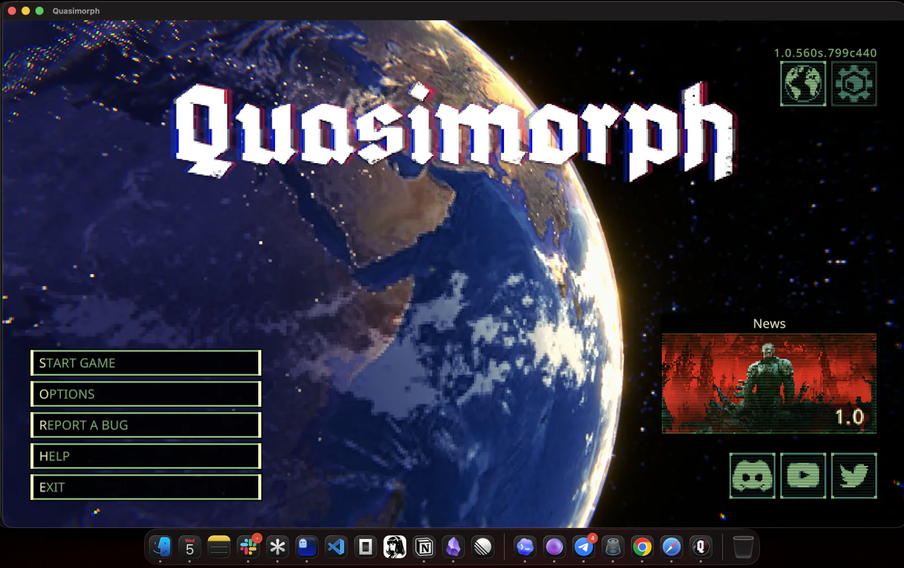

# Quasimorph for macOS

Builds a macOS app for **your own Steam or Windows copy** of Quasimorph.

No game files are included here. Nothing is uploaded.

## It works



*Quasimorph 1.0 running on Apple Silicon macOS from a wrapper produced by this tool.*

## You need

- Apple Silicon Mac
- macOS 13 or newer
- Quasimorph in your Steam account, or a local Windows copy
- Internet for the first build

## Do this

1. Download `Quasimorph-for-macOS.zip` from [Releases](../../releases/latest).
2. Unzip it.
3. Open Terminal.
4. Run:

```bash
cd ~/Downloads/Quasimorph-for-macOS
```

## Steam version

**Experimental:** the Steam install/updater flow is verified. Downloading and launching the Steam build of Quasimorph still needs confirmation from someone who owns it on Steam.

Run:

```bash
./quasimorph-macos steam
```

Then:

1. Open the DMG created on your Desktop.
2. Drag `Quasimorph.app` to Applications.
3. Open it. The official Windows Steam client installs.
4. Sign in and install Quasimorph when Steam asks.
5. Open `Quasimorph.app` again to play.

Your password and Steam Guard stay inside Valve's Steam client. The CLI never asks for them.

## Local copy

Type this, add one space, then drag your RAR, ZIP, folder, or `Quasimorph.exe` into Terminal:

```bash
./quasimorph-macos build
```

Then press Return and open the DMG created on your Desktop.

Example:

```bash
./quasimorph-macos build "/Users/me/Downloads/Quasimorph.v1.0.rar"
```

No path? Use the picker:

```bash
./quasimorph-macos build
```

## Output

```text
Desktop/Quasimorph macOS/
├── Quasimorph.app
├── Quasimorph-macOS-v1.0.dmg
└── BUILD-REPORT.txt
```

## First launch

If macOS blocks it:

1. Right-click `Quasimorph.app`.
2. Click **Open**.
3. Click **Open** again.

## Stuck?

Run:

```bash
./quasimorph-macos doctor
```

Then retry with details:

```bash
./quasimorph-macos build "/path/to/game.rar" --verbose
```

## Important

- Steam mode downloads the game through the account that owns it. It does not bypass Steam.
- Steam remains responsible for Cloud, Workshop, achievements, ownership checks, and updates.
- Local mode supports RAR, 7Z, ZIP, folders, or `Quasimorph.exe`; other Windows installers are not supported.
- The tool downloads checksum-verified Sikarugir, Wine, DXMT, and 7-Zip components.
- After Steam installs the game, the app contains account-managed game files. **Do not redistribute it.**
- This is an unofficial compatibility tool. It is not affiliated with Quasimorph or Magnum Scriptum.

## Build from source

Requires Xcode Command Line Tools:

```bash
swift test
swift build -c release
```

Own code is MIT licensed. Downloaded components keep their original licenses. See [`THIRD_PARTY_NOTICES.md`](THIRD_PARTY_NOTICES.md).
